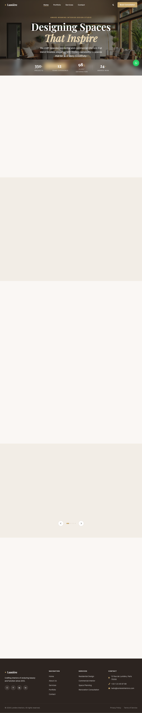

<div align="center">

# Lumière Interiors

[](https://developer.mozilla.org/en-US/docs/Web/HTML)
[](https://developer.mozilla.org/en-US/docs/Web/CSS)
[](https://developer.mozilla.org/en-US/docs/Web/JavaScript)
[](https://fontawesome.com/)
[](https://formsubmit.co/)
[](https://pages.github.com/)
[](#license)

**An Oriental interior design studio landing page — no frameworks, no build step. Pure HTML, CSS, and vanilla JavaScript with a Zen wabi-sabi aesthetic, dark-mode, scroll animations, a filterable portfolio gallery with lightbox, and a live enquiry form.**

🌐 **Live site:** https://hojianfeng.github.io/Atelier/

</div>

## Screenshot



## About

Lumière Interiors is a single-page marketing site for an Oriental interior design studio specialising in Zen, wabi-sabi, and East Asian aesthetics. Every visual decision — the rice-paper warm palette, the Cormorant Garamond calligraphic headings, the staggered wabi-sabi portfolio grid, the slow 0.9 s sine-eased scroll reveals — is designed to feel like stepping into a curated, serene showroom.

The entire design system is driven by CSS custom properties so a rebrand is a one-line change. Dark mode shifts backgrounds to deep teak/charcoal and is persisted to `localStorage` with zero flash. Scroll-triggered animations (`fade-up`, `fade-left`, `fade-right`) use a single `IntersectionObserver` with staggered CSS delays. The portfolio filter and lightbox share a live item list so previous/next navigation always cycles only the currently-visible category.

No jQuery, no framework, no bundler. Open `index.html` and it works.

## Key Features

### Oriental Zen Design System
- Rice-paper warm palette (`--clr-paper: #F5F0E8`, `--clr-linen: #EDE5D5`, `--clr-teak: #5A3E2B`) driven entirely by CSS custom properties
- Cormorant Garamond display serif + Lora body + Josefin Sans UI labels — three-level type hierarchy with calligraphic character
- Nearly-flat border-radius (2–6 px) and warm `rgba(44,32,22,…)` shadows throughout — no cool grey or glassy morphism
- Fixed SVG fractalNoise paper texture overlay at 3.5% opacity for tactile depth
- Slow 0.9 s `cubic-bezier(0.25, 0.46, 0.45, 0.94)` scroll reveals — incense-smoke pacing

### Portfolio & Lightbox
- Filterable grid across four categories (Living Room, Bedroom, Office, Kitchen)
- Staggered aspect ratios (4/5 → 4/3 → 3/4) between grid items for wabi-sabi variation
- Tab-style filter bar with bottom-border active indicator (not pills)
- Hover overlays reveal project title and category with a warm gradient lift
- Lightbox with keyboard navigation (← → Esc) and touch-swipe support
- Lightbox item list rebuilt from visible items on every filter change

### Testimonials Slider
- Auto-advancing carousel at 5 000 ms intervals with dot indicators
- Pauses on `mouseenter`, resumes on `mouseleave` and manual navigation
- CSS `translateX` driven — no JS animation loop

### Scroll Animations
- `fade-up`, `fade-left`, `fade-right` classes — invisible and off-axis by default
- Single `IntersectionObserver` adds `.visible` when element enters viewport
- Staggered delays via inline `--delay` CSS custom property

### Enquiry Form
- Client-side validation on name, email, and message
- POSTs JSON to FormSubmit.co via `fetch()` with loading state, success banner, and error fallback
- Honeypot field (`_honey`) for spam protection; `_captcha: false` suppresses reCAPTCHA

### UI Polish
- Dark / light mode toggle persisted to `localStorage`, zero flash on load
- Sticky frosted-glass navbar (backdrop-filter on scroll)
- Animated statistics counter (eased `requestAnimationFrame`) in the hero section
- Floating WhatsApp button and back-to-top button at z-index 800

## Tech Stack

| Layer | Technology |
|-------|-----------|
| **Markup** | HTML5 (semantic sectioning elements) |
| **Styling** | CSS3 — custom properties, Grid, Flexbox, `clamp()` |
| **Behaviour** | Vanilla JavaScript ES2020+ (no framework, no jQuery) |
| **Icons** | Font Awesome 6 (CDN) |
| **Fonts** | Google Fonts — Cormorant Garamond + Lora + Josefin Sans |
| **Form backend** | FormSubmit.co (no server required) |
| **Hosting** | GitHub Pages via GitHub Actions |

## Architecture

Three files, no build step:

| File | Role |
|------|------|
| `index.html` | All markup. Sections in DOM order: navbar → hero → about → services → portfolio → testimonials → contact → footer → lightbox modal (hidden) → floating buttons. |
| `style.css` | All styles. Organized top-to-bottom matching section order. CSS custom properties drive every color, font, spacing, and shadow. |
| `script.js` | All behaviour, wrapped in a single `DOMContentLoaded` listener. `$`/`$$` micro-helpers replace jQuery. |

### Theming system
All colors are CSS custom properties on `:root` (light) and `[data-theme="dark"]`. The `data-theme` attribute lives on `<html>`. The Oriental palette introduces semantic tokens (`--clr-paper`, `--clr-linen`, `--clr-teak`, `--clr-bark`, `--clr-ink`) mapped to legacy names for backward compatibility. Gold accent `--clr-gold: #C9A96E` is used sparingly — Shibui principle.

### z-index layers
navbar 900 → mobile overlay 1000 → lightbox backdrop 1100 → lightbox 1200 → lightbox controls 1300. Floating buttons at 800.

## Quick Start

No installation required.

```bash
# Open directly in your default browser
open index.html

# Force a specific browser
open -a "Google Chrome" index.html

# Serve locally (recommended for testing the enquiry form — avoids fetch() CORS issues on file://)
python3 -m http.server 8080
# then visit http://localhost:8080
```

### Enquiry form note
FormSubmit.co requires a **one-time email confirmation** on the very first submission before it delivers messages. Check the inbox for the configured recipient email after the first test submission.

## Deployment

The site deploys automatically to GitHub Pages on every push to `main` via `.github/workflows/deploy.yml`.

1. Push to `main` — the workflow triggers automatically.
2. After the first push, enable GitHub Pages in **Settings → Pages → Source: GitHub Actions**.
3. The live URL is `https://hojianfeng.github.io/Atelier/`.

## Adding Content

### New portfolio item
Copy an existing `.portfolio-item` div in `index.html`. Set `data-category` to one of `living-room`, `bedroom`, `office`, `kitchen`. Update `src`, `alt`, `.portfolio-cat`, and `.portfolio-title`. The filter and lightbox pick it up automatically — no JS changes needed.

### New section
Give it a unique `id` matching a `href="#id"` in the navbar. Use `.section-eyebrow` + `.section-heading` + `.section-sub` for consistent heading typography.

### New color
Always add a CSS custom property in `:root` (and a `[data-theme="dark"]` override directly below the component styles — never in the variable block at the top). Never use a hard-coded hex value outside the variable declaration.

## Security Notes

- **No secrets in the repo** — the FormSubmit recipient email is a public-facing contact address, not a credential.
- **Spam protection** — the enquiry form includes a honeypot field (`name="_honey"`) and submits with `_captcha: false` to suppress reCAPTCHA while still blocking bots.
- **No server-side code** — there is no backend, no database, and no authentication surface. The attack surface is limited to the static HTML/CSS/JS served over GitHub Pages.

## License

MIT
